# 🔧 Patterns Avancés et Relations Complexes - GESFARM

## 1. 🎯 Pattern Polymorphe (Polymorphic Relations)

```mermaid
classDiagram
    class Transaction {
        +id: bigint
        +type: string
        +amount: decimal
        +related_entity_id: bigint
        +related_entity_type: string
        +getRelatedEntity()
        +setRelatedEntity(entity)
    }
    
    class Notification {
        +id: bigint
        +type: string
        +title: string
        +related_entity_id: bigint
        +related_entity_type: string
        +getRelatedEntity()
    }
    
    class Task {
        +id: bigint
        +title: string
        +related_entity_id: bigint
        +related_entity_type: string
        +getRelatedEntity()
    }
    
    class Document {
        +id: bigint
        +name: string
        +related_entity_id: bigint
        +related_entity_type: string
        +getRelatedEntity()
    }
    
    class PoultryFlock {
        +id: bigint
        +name: string
        +transactions()
        +notifications()
        +tasks()
        +documents()
    }
    
    class Cattle {
        +id: bigint
        +identification_number: string
        +transactions()
        +notifications()
        +tasks()
        +documents()
    }
    
    class Crop {
        +id: bigint
        +name: string
        +transactions()
        +notifications()
        +tasks()
        +documents()
    }
    
    %% Relations polymorphes
    Transaction }o--|| PoultryFlock : related_to
    Transaction }o--|| Cattle : related_to
    Transaction }o--|| Crop : related_to
    
    Notification }o--|| PoultryFlock : related_to
    Notification }o--|| Cattle : related_to
    Notification }o--|| Crop : related_to
    
    Task }o--|| PoultryFlock : related_to
    Task }o--|| Cattle : related_to
    Task }o--|| Crop : related_to
    
    Document }o--|| PoultryFlock : related_to
    Document }o--|| Cattle : related_to
    Document }o--|| Crop : related_to
```

---

## 2. 🔄 Pattern Observer (Notifications)

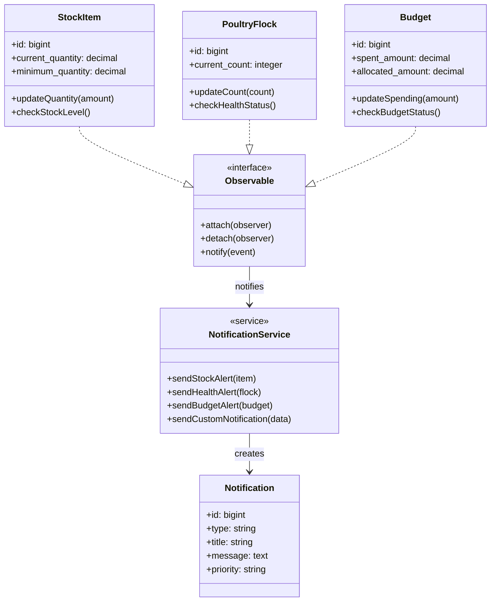

---

## 3. 🏭 Pattern Factory (Création d'Entités)

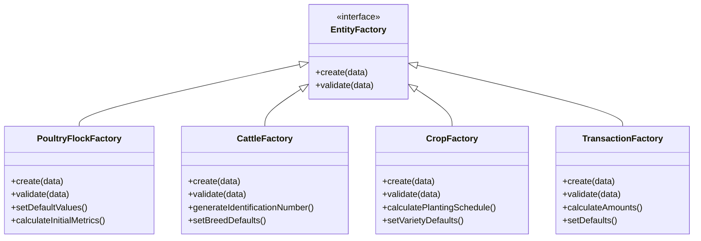

---

## 4. 📊 Pattern Strategy (Calculs et Analytics)

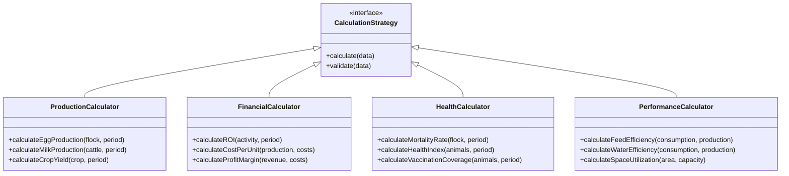

---

## 5. 🎯 Pattern Repository (Accès aux Données)

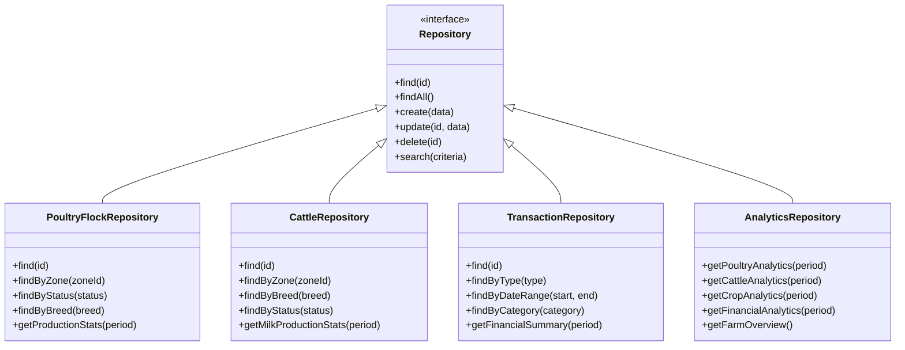

---

## 6. 🔐 Pattern Decorator (Sécurité et Validation)

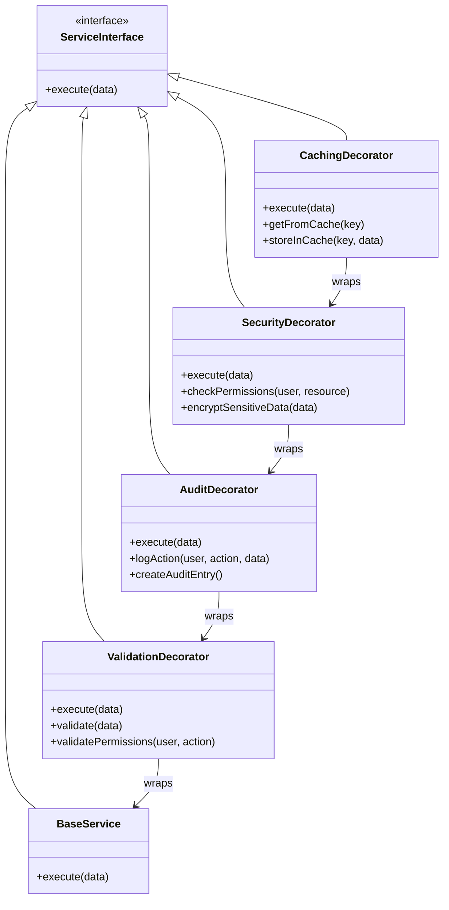

---

## 7. 📋 Pattern Command (Actions et Tâches)

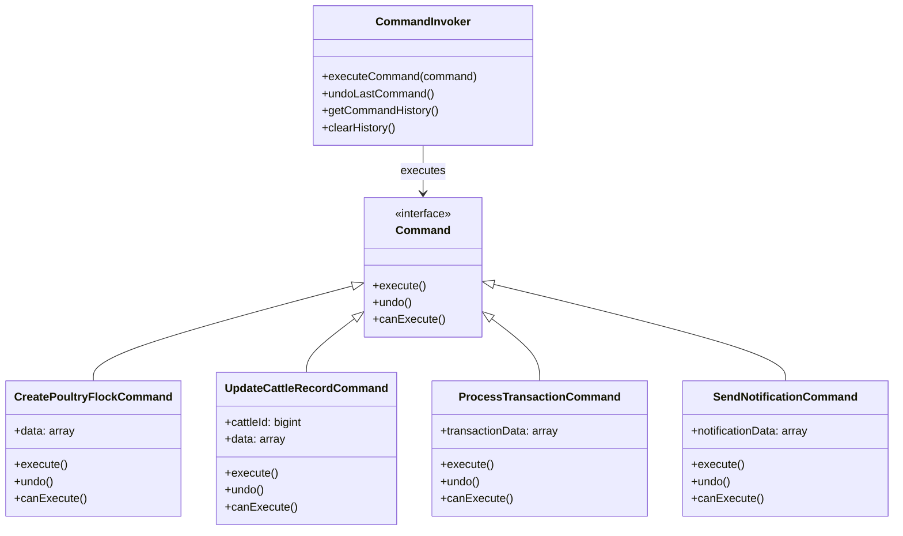

---

## 8. 🔄 Pattern State (États des Entités)

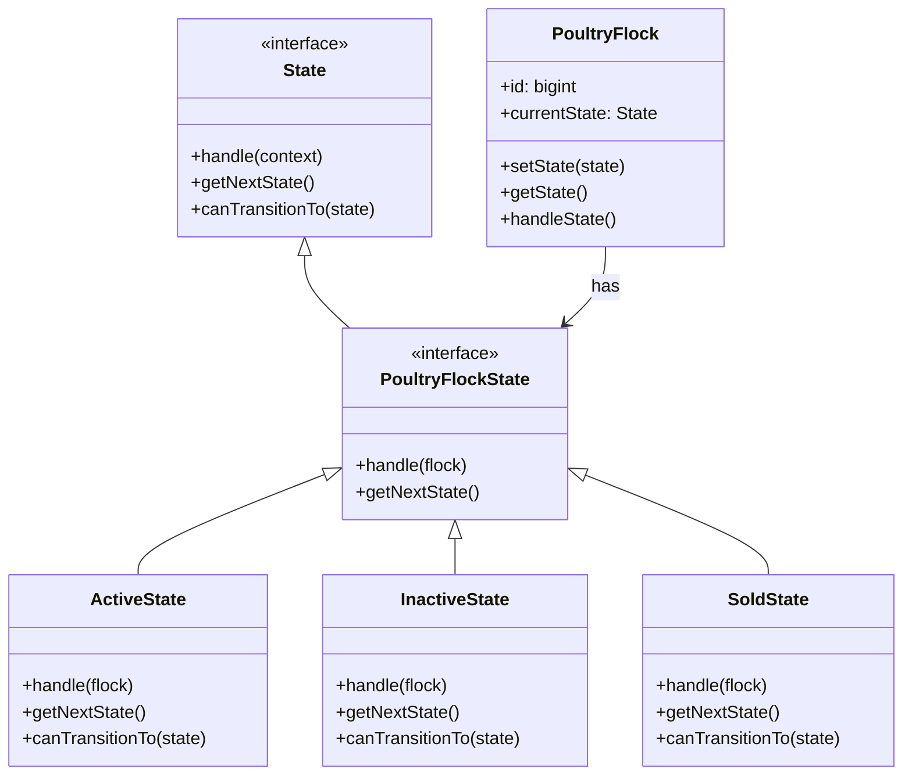

---

## 9. 📊 Pattern Composite (Structure Hiérarchique)

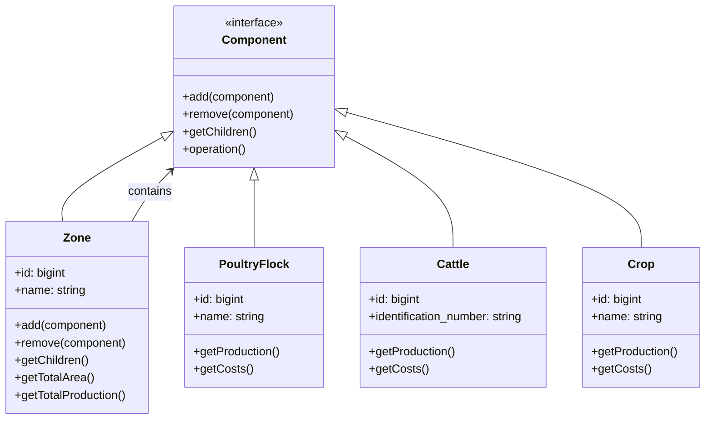

---

## 10. 🎯 Pattern Facade (Interface Simplifiée)

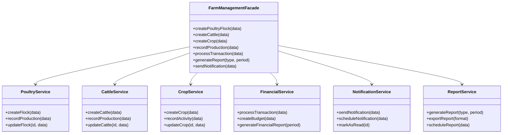

---

## 11. 🔄 Pattern Chain of Responsibility (Validation)

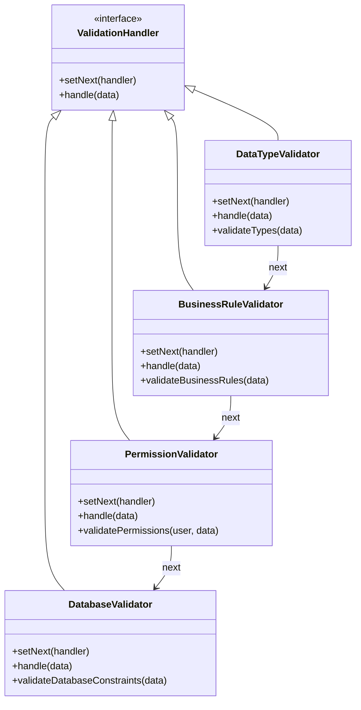

---

## 12. 📊 Pattern Template Method (Processus Standardisés)

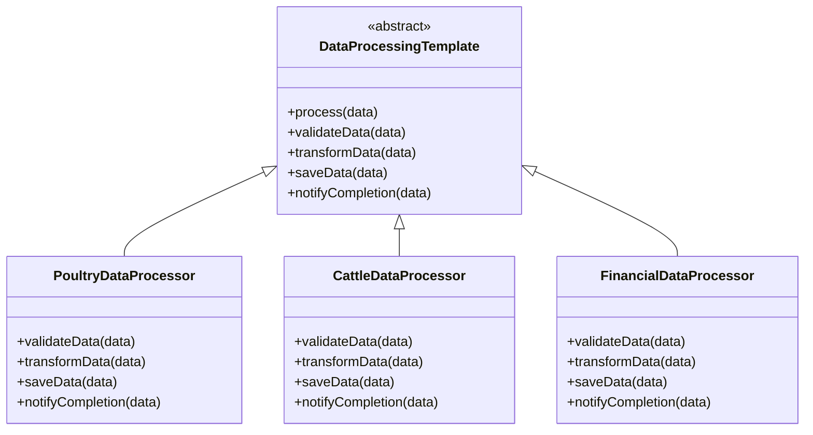

---

## Résumé des Patterns Utilisés

### 🎯 Patterns de Création
- **Factory** : Création d'entités complexes
- **Builder** : Construction d'objets complexes

### 🔄 Patterns Comportementaux
- **Observer** : Système de notifications
- **Strategy** : Calculs et analytics
- **Command** : Actions et tâches
- **State** : Gestion des états
- **Chain of Responsibility** : Validation en chaîne
- **Template Method** : Processus standardisés

### 🏗️ Patterns Structurels
- **Decorator** : Sécurité et validation
- **Facade** : Interface simplifiée
- **Composite** : Structure hiérarchique
- **Repository** : Accès aux données

### 🔐 Patterns de Sécurité
- **Polymorphic Relations** : Relations flexibles
- **Audit Trail** : Traçabilité des actions
- **Permission System** : Contrôle d'accès

Ces patterns permettent une architecture robuste, maintenable et extensible pour le système GESFARM, en respectant les principes SOLID et les bonnes pratiques de développement.

