# 🎮 Diagrammes des Contrôleurs et Services - GESFARM

## 1. 🎮 Architecture des Contrôleurs

```mermaid
classDiagram
    class BaseController {
        <<abstract>>
        +validateRequest(data)
        +handleResponse(data)
        +handleError(error)
        +authorize(user, action)
    }
    
    class AuthController {
        +login(credentials)
        +logout()
        +profile()
        +refreshToken()
        +validateToken()
    }
    
    class StockController {
        +index()
        +store(request)
        +show(id)
        +update(id, request)
        +destroy(id)
        +recordMovement(request)
    }
    
    class PoultryController {
        +index()
        +store(request)
        +show(id)
        +update(id, request)
        +destroy(id)
        +recordData(request)
        +incubationRecords()
        +createIncubationRecord(request)
        +updateIncubationResults(id, request)
    }
    
    class CattleController {
        +index()
        +store(request)
        +show(id)
        +update(id, request)
        +destroy(id)
        +recordData(request)
    }
    
    class CropController {
        +index()
        +store(request)
        +show(id)
        +update(id, request)
        +destroy(id)
        +recordActivity(request)
        +activities(id)
    }
    
    class FinancialController {
        +getTransactions(request)
        +createTransaction(request)
        +getTransaction(id)
        +updateTransaction(id, request)
        +deleteTransaction(id)
        +getBudgets(request)
        +createBudget(request)
        +getFinancialReports(request)
    }
    
    class VeterinaryController {
        +getTreatments(request)
        +createTreatment(request)
        +getTreatment(id)
        +updateTreatment(id, request)
        +deleteTreatment(id)
        +getSchedule(request)
        +getReminders()
        +getAnimalHistory(request)
        +getVeterinaryStats(request)
    }
    
    class NotificationController {
        +getNotifications(request)
        +getUnreadNotifications()
        +markAsRead(id)
        +markAllAsRead()
        +createNotification(request)
        +deleteNotification(id)
        +getNotificationStats()
    }
    
    class AnalyticsController {
        +getPoultryAnalytics(request)
        +getCattleAnalytics(request)
        +getCropAnalytics(request)
        +getFarmOverview()
    }
    
    class DashboardController {
        +index()
        +stockAlerts()
        +poultryStats()
        +cattleStats()
        +cropStats()
        +taskStats()
    }
    
    BaseController <|-- AuthController
    BaseController <|-- StockController
    BaseController <|-- PoultryController
    BaseController <|-- CattleController
    BaseController <|-- CropController
    BaseController <|-- FinancialController
    BaseController <|-- VeterinaryController
    BaseController <|-- NotificationController
    BaseController <|-- AnalyticsController
    BaseController <|-- DashboardController
```

---

## 2. 🔧 Architecture des Services

```mermaid
classDiagram
    class ServiceInterface {
        <<interface>>
        +execute(data)
        +validate(data)
    }
    
    class PoultryService {
        +createFlock(data)
        +updateFlock(id, data)
        +recordProduction(data)
        +calculateMetrics(flockId)
        +getProductionHistory(flockId)
        +scheduleVaccination(flockId, data)
    }
    
    class CattleService {
        +createCattle(data)
        +updateCattle(id, data)
        +recordProduction(data)
        +calculateMetrics(cattleId)
        +getProductionHistory(cattleId)
        +scheduleTreatment(cattleId, data)
    }
    
    class CropService {
        +createCrop(data)
        +updateCrop(id, data)
        +recordActivity(data)
        +calculateYield(cropId)
        +getActivityHistory(cropId)
        +scheduleHarvest(cropId, data)
    }
    
    class FinancialService {
        +processTransaction(data)
        +createBudget(data)
        +updateBudget(id, data)
        +calculateROI(activityId)
        +generateFinancialReport(period)
        +validateTransaction(data)
    }
    
    class NotificationService {
        +sendNotification(data)
        +scheduleNotification(data)
        +markAsRead(id)
        +getUserNotifications(userId)
        +createAlert(data)
        +processScheduledNotifications()
    }
    
    class AnalyticsService {
        +calculatePoultryAnalytics(period)
        +calculateCattleAnalytics(period)
        +calculateCropAnalytics(period)
        +generateFarmOverview()
        +predictProduction(data)
        +optimizeResources(data)
    }
    
    class ValidationService {
        +validatePoultryData(data)
        +validateCattleData(data)
        +validateCropData(data)
        +validateFinancialData(data)
        +validateUserPermissions(user, action)
    }
    
    class ReportService {
        +generatePoultryReport(period)
        +generateCattleReport(period)
        +generateCropReport(period)
        +generateFinancialReport(period)
        +exportReport(type, format)
    }
    
    ServiceInterface <|-- PoultryService
    ServiceInterface <|-- CattleService
    ServiceInterface <|-- CropService
    ServiceInterface <|-- FinancialService
    ServiceInterface <|-- NotificationService
    ServiceInterface <|-- AnalyticsService
    ServiceInterface <|-- ValidationService
    ServiceInterface <|-- ReportService
```

---

## 3. 🔄 Relations Contrôleurs-Services

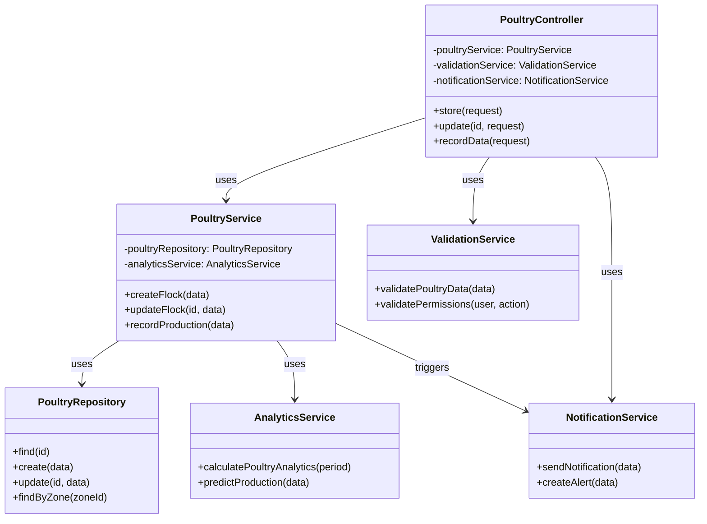

---

## 4. 🎯 Pattern Service Layer

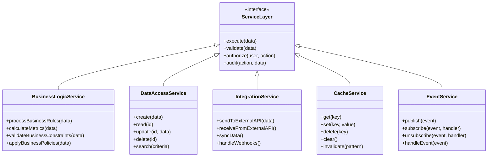

---

## 5. 🔐 Architecture de Sécurité

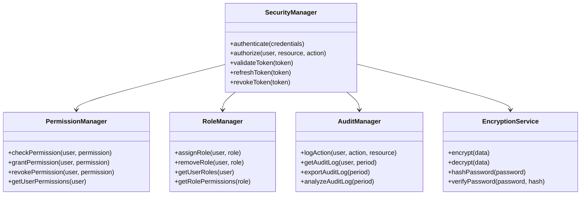

---

## 6. 📊 Architecture des Analytics

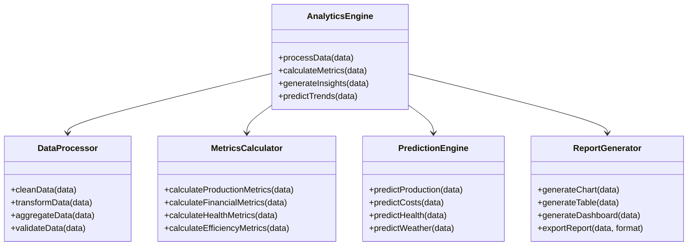

---

## 7. 🔔 Architecture des Notifications

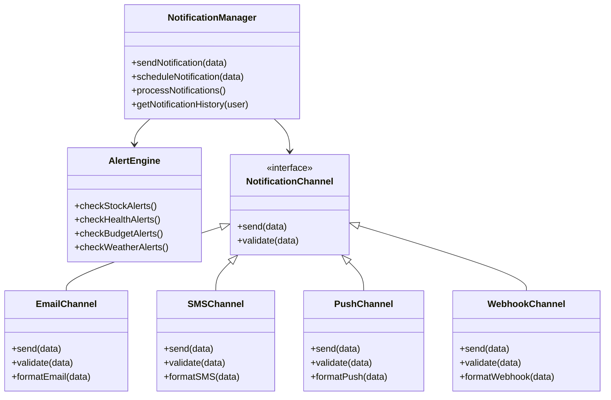

---

## 8. 🗄️ Architecture des Repositories

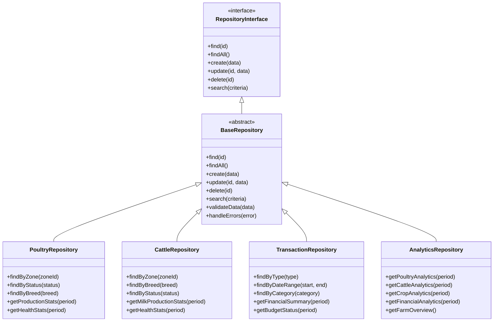

---

## 9. 🔄 Architecture des Middlewares

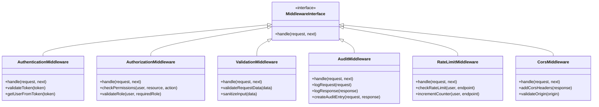

---

## 10. 🎯 Architecture des Form Requests

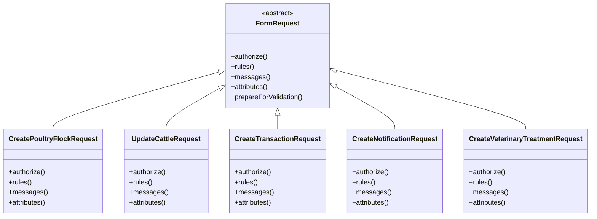

---

## 11. 🔄 Flux de Données Complet

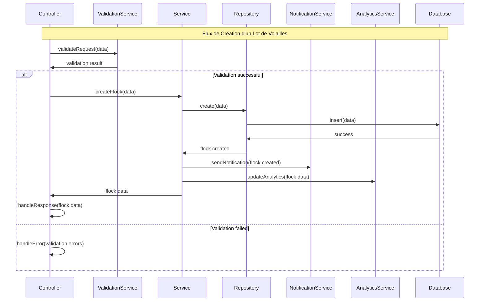

---

## Résumé de l'Architecture

### 🎮 Contrôleurs (10)
- **BaseController** : Contrôleur de base avec fonctionnalités communes
- **AuthController** : Authentification et autorisation
- **StockController** : Gestion des stocks
- **PoultryController** : Gestion avicole
- **CattleController** : Gestion bovine
- **CropController** : Gestion des cultures
- **FinancialController** : Gestion financière
- **VeterinaryController** : Gestion vétérinaire
- **NotificationController** : Gestion des notifications
- **AnalyticsController** : Analytics et rapports
- **DashboardController** : Tableau de bord

### 🔧 Services (8)
- **PoultryService** : Logique métier avicole
- **CattleService** : Logique métier bovine
- **CropService** : Logique métier des cultures
- **FinancialService** : Logique métier financière
- **NotificationService** : Gestion des notifications
- **AnalyticsService** : Calculs et analytics
- **ValidationService** : Validation des données
- **ReportService** : Génération de rapports

### 🗄️ Repositories (4)
- **PoultryRepository** : Accès aux données avicoles
- **CattleRepository** : Accès aux données bovines
- **TransactionRepository** : Accès aux données financières
- **AnalyticsRepository** : Accès aux données d'analytics

### 🔐 Sécurité (4)
- **SecurityManager** : Gestion de la sécurité
- **PermissionManager** : Gestion des permissions
- **RoleManager** : Gestion des rôles
- **AuditManager** : Gestion de l'audit

Cette architecture respecte les principes SOLID et les patterns de conception modernes, offrant une base solide et extensible pour le système GESFARM.

