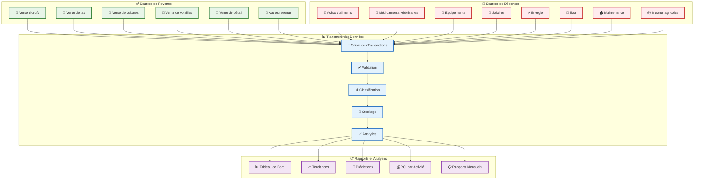
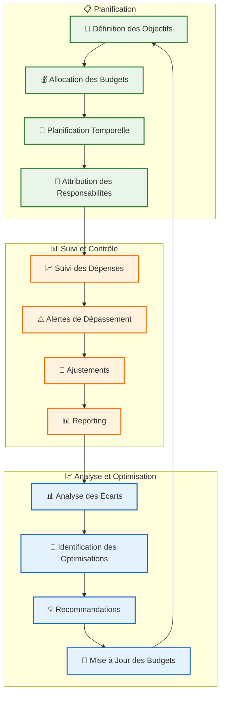
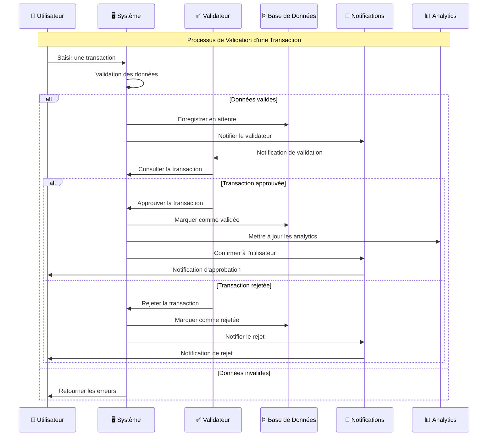
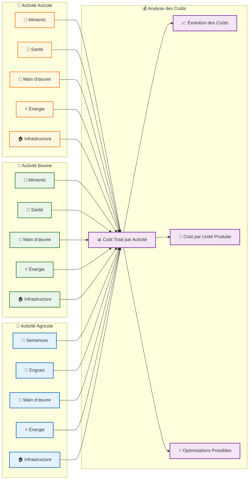
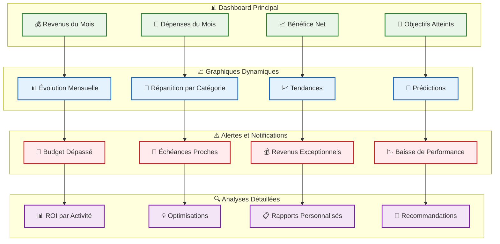

# 💰 Diagrammes des Flux Financiers - GESFARM

## Flux de Données Financières

---

## Processus de Gestion Budgétaire

---

## Flux de Validation des Transactions

---

## Matrice des Coûts par Activité

---

## Dashboard Financier Interactif

---

## Intégration avec les Autres Modules

```mermaid
graph TB
    subgraph "💰 Module Financier"
        F1[📝 Transactions]
        F2[📊 Budgets]
        F3[📈 Analytics]
        F4[📋 Rapports]
    end
    
    subgraph "🐔 Module Avicole"
        A1[🥚 Production d'œufs]
        A2[🌾 Consommation d'aliments]
        A3[💊 Coûts vétérinaires]
    end
    
    subgraph "🐄 Module Bovin"
        B1[🥛 Production laitière]
        B2[🌾 Consommation d'aliments]
        B3[💊 Coûts vétérinaires]
    end
    
    subgraph "🌾 Module Agricole"
        C1[🌱 Coûts des semences]
        C2[🌿 Coûts des engrais]
        C3[👷 Main d'œuvre]
    end
    
    subgraph "📦 Module Stocks"
        S1[📦 Valeur des stocks]
        S2[📉 Dépenses d'achat]
        S3[📊 Rotation des stocks]
    end
    
    %% Intégrations
    A1 --> F1
    A2 --> F1
    A3 --> F1
    
    B1 --> F1
    B2 --> F1
    B3 --> F1
    
    C1 --> F1
    C2 --> F1
    C3 --> F1
    
    S1 --> F1
    S2 --> F1
    S3 --> F1
    
    F1 --> F2
    F1 --> F3
    F1 --> F4
    
    %% Styles
    classDef financial fill:#e8f5e8,stroke:#2e7d32,stroke-width:2px
    classDef poultry fill:#fff8e1,stroke:#f57f17,stroke-width:2px
    classDef cattle fill:#e3f2fd,stroke:#1565c0,stroke-width:2px
    classDef crops fill:#f3e5f5,stroke:#7b1fa2,stroke-width:2px
    classDef stock fill:#fff3e0,stroke:#ef6c00,stroke-width:2px
    
    class F1,F2,F3,F4 financial
    class A1,A2,A3 poultry
    class B1,B2,B3 cattle
    class C1,C2,C3 crops
    class S1,S2,S3 stock
```

Ces diagrammes montrent comment le module financier s'intègre avec tous les autres modules du système GESFARM, permettant une gestion financière complète et intégrée de l'exploitation agropastorale.

