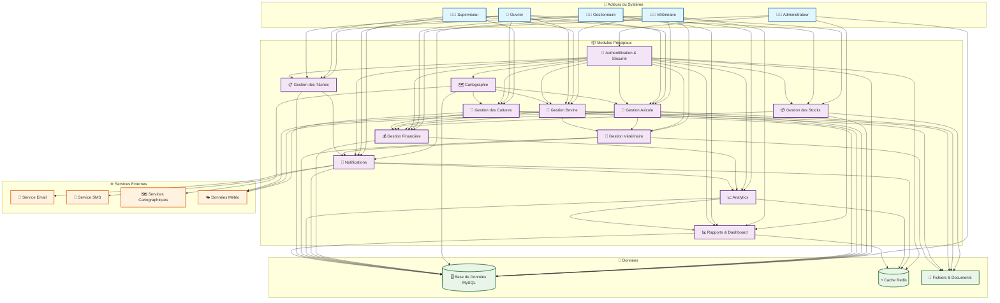
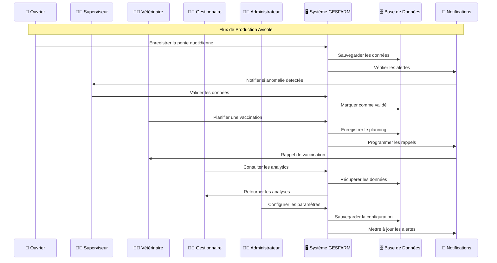
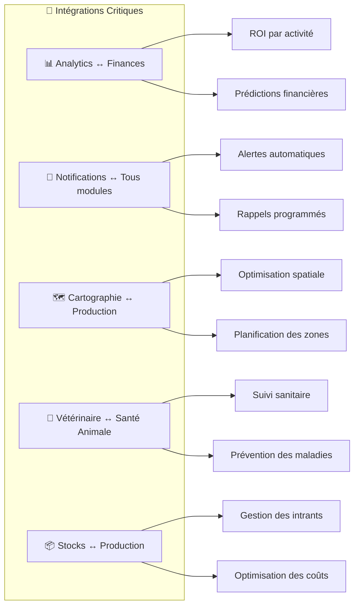
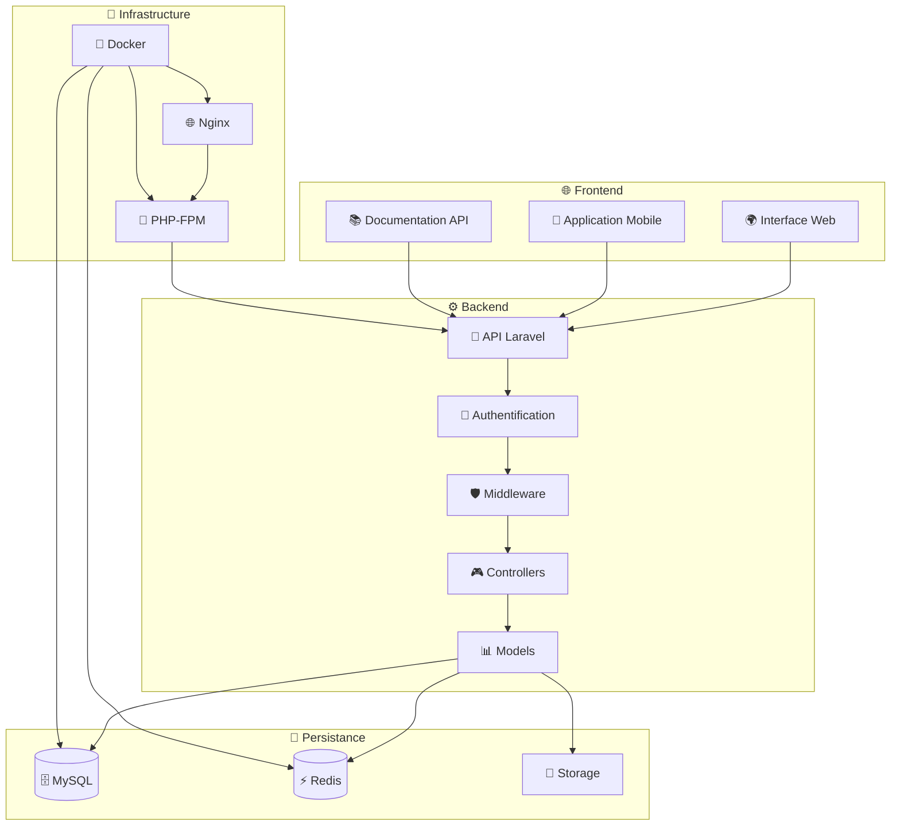

# 🏗️ Vue d'Ensemble du Système GESFARM

## Diagramme Global des Acteurs et Modules

---

## Flux de Données Principal

---

## Matrice des Permissions

| Module | Administrateur | Gestionnaire | Vétérinaire | Superviseur | Ouvrier |
|--------|---------------|--------------|-------------|-------------|---------|
| **Authentification** | ✅ CRUD | 👁️ R | 👁️ R | 👁️ R | 👁️ R |
| **Stocks** | ✅ CRUD | ✅ CRUD | 👁️ R | ✅ CRUD | ✅ CRUD |
| **Avicole** | ✅ CRUD | ✅ CRUD | ✅ CRUD | ✅ CRUD | ✅ CRUD |
| **Bovine** | ✅ CRUD | ✅ CRUD | ✅ CRUD | ✅ CRUD | ✅ CRUD |
| **Cultures** | ✅ CRUD | ✅ CRUD | 👁️ R | ✅ CRUD | ✅ CRUD |
| **Cartographie** | ✅ CRUD | ✅ CRUD | 👁️ R | ✅ CRUD | 👁️ R |
| **Financier** | ✅ CRUD | ✅ CRUD | 👁️ R | 👁️ R | 👁️ R |
| **Notifications** | ✅ CRUD | ✅ CRUD | ✅ CRUD | ✅ CRUD | ✅ CRUD |
| **Analytics** | ✅ CRUD | ✅ CRUD | 👁️ R | 👁️ R | 👁️ R |
| **Vétérinaire** | ✅ CRUD | 👁️ R | ✅ CRUD | 👁️ R | 👁️ R |
| **Tâches** | ✅ CRUD | ✅ CRUD | 👁️ R | ✅ CRUD | ✅ CRUD |
| **Rapports** | ✅ CRUD | ✅ CRUD | ✅ CRUD | 👁️ R | 👁️ R |

**Légende :**
- ✅ CRUD : Créer, Lire, Modifier, Supprimer
- 👁️ R : Lecture seule

---

## Points d'Intégration Critiques

---

## Architecture Technique

Cette architecture montre comment les différents acteurs interagissent avec le système GESFARM, avec des permissions et des responsabilités bien définies pour chaque rôle.
