# 📊 Diagrammes de Cas d'Utilisation - GESFARM

## Vue d'ensemble des Acteurs

Le système GESFARM comprend plusieurs acteurs principaux :

- **👨‍💼 Administrateur** : Gestion complète du système
- **👨‍⚕️ Vétérinaire** : Soins et santé des animaux
- **👨‍💼 Gestionnaire** : Supervision et rapports
- **👷 Ouvrier** : Saisie de données et exécution des tâches
- **👨‍🌾 Superviseur** : Contrôle et validation des activités

---

## 1. 👨‍💼 Administrateur

```mermaid
graph TD
    A[👨‍💼 Administrateur] --> B[Gestion des Utilisateurs]
    A --> C[Gestion des Rôles et Permissions]
    A --> D[Configuration du Système]
    A --> E[Gestion des Sauvegardes]
    A --> F[Monitoring et Logs]
    A --> G[Gestion Financière Globale]
    
    B --> B1[Créer des utilisateurs]
    B --> B2[Modifier des utilisateurs]
    B --> B3[Supprimer des utilisateurs]
    B --> B4[Activer/Désactiver des comptes]
    
    C --> C1[Créer des rôles]
    C --> C2[Assigner des permissions]
    C --> C3[Modifier les rôles]
    
    D --> D1[Configurer les paramètres]
    D --> D2[Gérer les catégories de stock]
    D --> D3[Configurer les zones]
    
    E --> E1[Planifier les sauvegardes]
    E --> E2[Restauration des données]
    E --> E3[Archivage des données]
    
    F --> F1[Consulter les logs d'audit]
    F --> F2[Monitoring des performances]
    F --> F3[Alertes système]
    
    G --> G1[Approuver les budgets]
    G --> G2[Valider les transactions importantes]
    G --> G3[Consulter les rapports financiers]
```

---

## 2. 👨‍⚕️ Vétérinaire

```mermaid
graph TD
    V[👨‍⚕️ Vétérinaire] --> V1[Gestion des Soins]
    V --> V2[Planning des Vaccinations]
    V --> V3[Suivi de la Santé]
    V --> V4[Rapports Vétérinaires]
    V --> V5[Gestion des Médicaments]
    
    V1 --> V1a[Enregistrer un traitement]
    V1 --> V1b[Modifier un traitement]
    V1 --> V1c[Consulter l'historique médical]
    V1 --> V1d[Prescrire des médicaments]
    
    V2 --> V2a[Planifier une vaccination]
    V2 --> V2b[Consulter le planning]
    V2 --> V2c[Marquer comme effectué]
    V2 --> V2d[Programmer les rappels]
    
    V3 --> V3a[Enregistrer l'état de santé]
    V3 --> V3b[Suivre l'évolution]
    V3 --> V3c[Identifier les problèmes]
    V3 --> V3d[Alertes de santé]
    
    V4 --> V4a[Générer des rapports de santé]
    V4 --> V4b[Statistiques de mortalité]
    V4 --> V4c[Efficacité des traitements]
    V4 --> V4d[Coûts des soins]
    
    V5 --> V5a[Gérer l'inventaire vétérinaire]
    V5 --> V5b[Suivre les dates d'expiration]
    V5 --> V5c[Calculer les dosages]
    V5 --> V5d[Alertes de stock bas]
```

---

## 3. 👨‍💼 Gestionnaire

```mermaid
graph TD
    G[👨‍💼 Gestionnaire] --> G1[Supervision Générale]
    G --> G2[Gestion des Rapports]
    G --> G3[Planification des Activités]
    G --> G4[Contrôle de Qualité]
    G --> G5[Gestion des Ressources]
    
    G1 --> G1a[Tableau de bord global]
    G1 --> G1b[Monitoring des KPIs]
    G1 --> G1c[Alertes importantes]
    G1 --> G1d[Vue d'ensemble des activités]
    
    G2 --> G2a[Rapports de production]
    G2 --> G2b[Rapports financiers]
    G2 --> G2c[Rapports de performance]
    G2 --> G2d[Analytics avancés]
    
    G3 --> G3a[Planifier les semis]
    G3 --> G3b[Organiser les récoltes]
    G3 --> G3c[Programmer les soins]
    G3 --> G3d[Optimiser les ressources]
    
    G4 --> G4a[Contrôler la qualité]
    G4 --> G4b[Valider les données]
    G4 --> G4c[Auditer les processus]
    G4 --> G4d[Améliorer les procédures]
    
    G5 --> G5a[Gérer les stocks]
    G5 --> G5b[Planifier les achats]
    G5 --> G5c[Optimiser les coûts]
    G5 --> G5d[Gérer les budgets]
```

---

## 4. 👷 Ouvrier

```mermaid
graph TD
    O[👷 Ouvrier] --> O1[Saisie de Données]
    O --> O2[Exécution des Tâches]
    O --> O3[Gestion des Stocks]
    O --> O4[Maintenance]
    O --> O5[Production]
    
    O1 --> O1a[Enregistrer la ponte]
    O1 --> O1b[Saisir les données de production]
    O1 --> O1c[Enregistrer les activités]
    O1 --> O1d[Noter les observations]
    
    O2 --> O2a[Consulter ses tâches]
    O2 --> O2b[Marquer comme terminé]
    O2 --> O2c[Signaler des problèmes]
    O2 --> O2d[Demander de l'aide]
    
    O3 --> O3a[Enregistrer les mouvements]
    O3 --> O3b[Vérifier les stocks]
    O3 --> O3c[Signaler les manques]
    O3 --> O3d[Organiser l'inventaire]
    
    O4 --> O4a[Nettoyer les installations]
    O4 --> O4b[Entretenir les équipements]
    O4 --> O4c[Signaler les pannes]
    O4 --> O4d[Effectuer les réparations]
    
    O5 --> O5a[Collecter les œufs]
    O5 --> O5b[Traire les vaches]
    O5 --> O5c[Récolter les cultures]
    O5 --> O5d[Conditionner les produits]
```

---

## 5. 👨‍🌾 Superviseur

```mermaid
graph TD
    S[👨‍🌾 Superviseur] --> S1[Contrôle des Activités]
    S --> S2[Validation des Données]
    S --> S3[Formation du Personnel]
    S --> S4[Optimisation des Processus]
    S --> S5[Communication]
    
    S1 --> S1a[Superviser les équipes]
    S1 --> S1b[Contrôler la qualité]
    S1 --> S1c[Vérifier les procédures]
    S1 --> S1d[Évaluer les performances]
    
    S2 --> S2a[Valider les saisies]
    S2 --> S2b[Corriger les erreurs]
    S2 --> S2c[Approuver les données]
    S2 --> S2d[Assurer la cohérence]
    
    S3 --> S3a[Former les nouveaux]
    S3 --> S3b[Actualiser les compétences]
    S3 --> S3c[Évaluer les apprentissages]
    S3 --> S3d[Documenter les procédures]
    
    S4 --> S4a[Analyser les processus]
    S4 --> S4b[Proposer des améliorations]
    S4 --> S4c[Implémenter les changements]
    S4 --> S4d[Mesurer l'efficacité]
    
    S5 --> S5a[Communiquer avec l'équipe]
    S5 --> S5b[Transmettre les consignes]
    S5 --> S5c[Rapporter à la direction]
    S5 --> S5d[Coordonner les activités]
```

---

## 6. 🔄 Interactions Inter-Acteurs

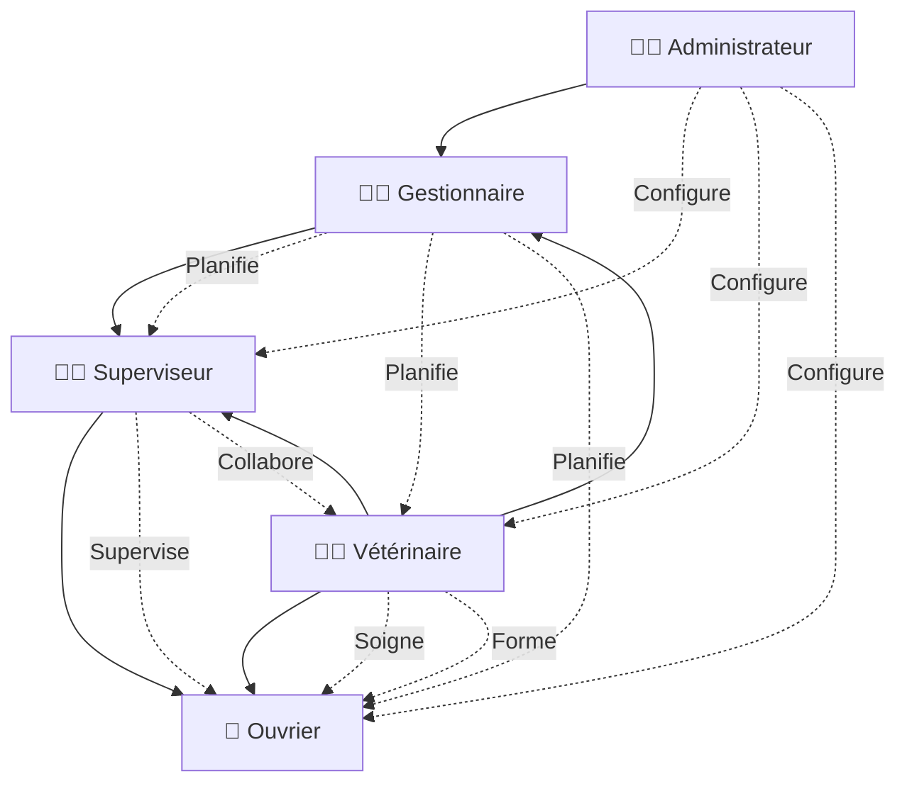

---

## 7. 📱 Cas d'Utilisation par Module

### Module Avicole
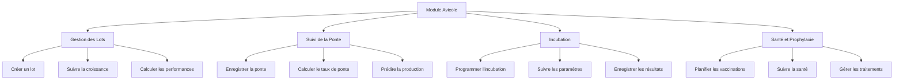

### Module Financier
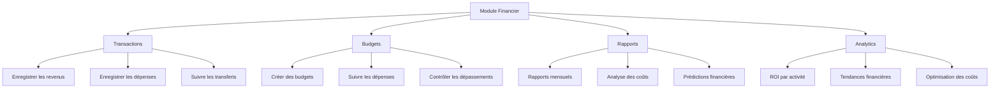

---

## 8. 🔔 Système de Notifications

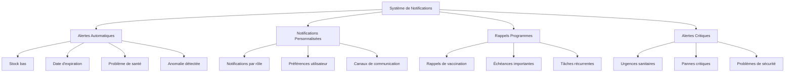

---

## 9. 📊 Analytics et Rapports

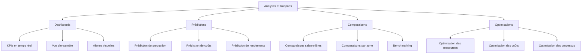

---

## 10. 🗺️ Cartographie et Zones

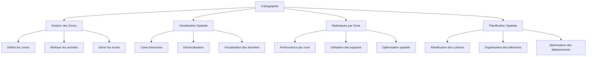

---

## Résumé des Interactions

| Acteur | Modules Principaux | Interactions |
|--------|-------------------|--------------|
| **Administrateur** | Tous les modules | Configuration, supervision, maintenance |
| **Vétérinaire** | Santé, Notifications, Rapports | Soins, formation, conseils |
| **Gestionnaire** | Analytics, Finances, Rapports | Planification, contrôle, optimisation |
| **Superviseur** | Tous les modules (lecture) | Validation, formation, coordination |
| **Ouvrier** | Production, Stocks, Tâches | Saisie, exécution, maintenance |

Ces diagrammes montrent la complexité et l'interconnexion des différents acteurs dans le système GESFARM, chacun ayant des responsabilités spécifiques tout en collaborant pour assurer le bon fonctionnement de l'exploitation agropastorale.
